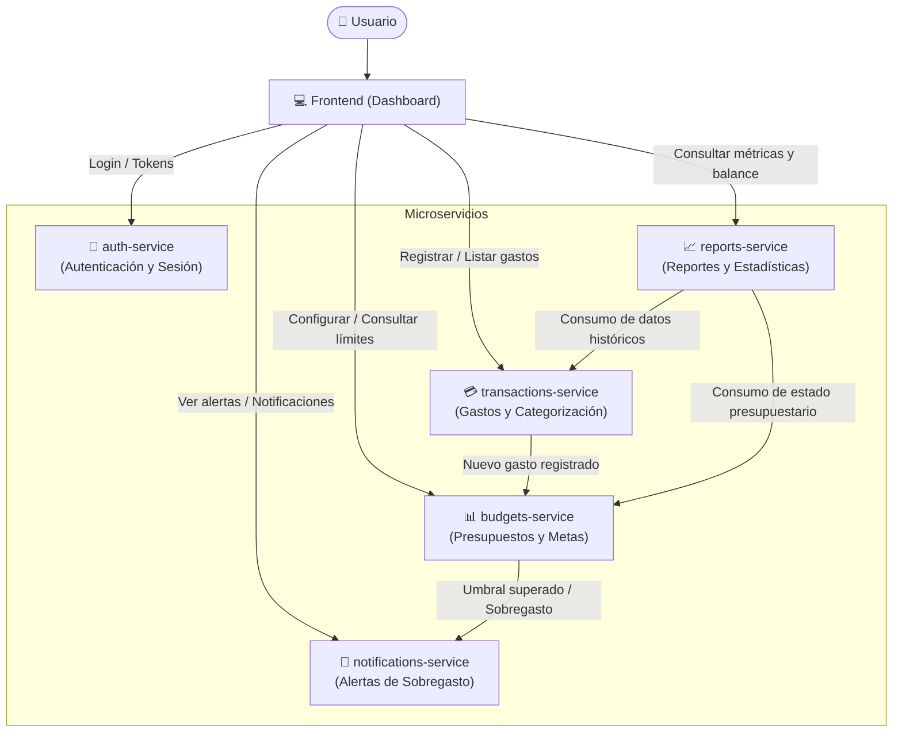

# Sila — App de Finanzas Personales

**Sila** es una aplicación de finanzas personales para uso individual, diseñada para ayudar al usuario a registrar gastos, gestionar presupuestos, monitorear límites mediante alertas de sobregasto y consultar reportes periódicos automáticos.

La solución está organizada bajo un esquema de **monorepo con microservicios independientes** y un frontend centralizado (dashboard).

---

## 🏛️ Diagrama de Arquitectura



---

## 📂 Estructura del Monorepo

```text
sila/
├── frontend/               # Dashboard interactivo para el usuario
├── auth-service/           # Microservicio de autenticación y sesiones
├── transactions-service/   # Microservicio de registro y categorización de gastos
├── budgets-service/        # Microservicio de control de presupuestos
├── notifications-service/  # Microservicio de generación y despacho de alertas
├── reports-service/        # Microservicio de reportes y agregaciones financieras
└── README.md               # Documentación general de la arquitectura
```

---

## 🧩 Propósito de Cada Componente

### 1. `frontend` (Dashboard)
- **Propósito:** Interfaz de usuario interactiva y responsiva para el uso diario de Sila.
- **Responsabilidades:**
  - Permitir el inicio de sesión y gestión de credenciales.
  - Formulario ágil para carga de gastos y categorización.
  - Visualización del estado actual de los presupuestos (barras de progreso, umbrales).
  - Bandeja de alertas y notificaciones visuales inmediatas.
  - Visualización gráfica de reportes periódicos (mensuales, semanales, por categoría).

---

### 2. `auth-service` (Autenticación)
- **Propósito:** Proteger el acceso a la plataforma y gestionar la identidad del usuario.
- **Responsabilidades:**
  - Registro, inicio de sesión y validación de credenciales.
  - Generación, renovación y validación de tokens de acceso (JWT o tokens de sesión).
  - Asegurar que todas las peticiones a los demás microservicios provengan del usuario autenticado.

---

### 3. `transactions-service` (Registro y Categorización de Gastos)
- **Propósito:** Núcleo transaccional de ingresos y egresos.
- **Responsabilidades:**
  - Alta, baja, modificación y consulta de transacciones (gastos e ingresos).
  - Clasificación y etiquetado por categorías (ej. alimentación, transporte, servicios, ocio).
  - Almacenamiento cronológico de movimientos financieros.
  - Notificar a otros servicios (o emitir eventos) cuando se registra una nueva transacción para evaluar presupuestos.

---

### 4. `budgets-service` (Presupuestos)
- **Propósito:** Administración de metas y límites de gasto.
- **Responsabilidades:**
  - Definición de presupuestos por período (mensual, semanal) y por categoría o globales.
  - Comparación del consumo acumulado frente a los límites establecidos.
  - Detección de desviaciones o umbrales críticos (por ejemplo: 80% consumido, 100% alcanzado o sobregasto).
  - Disparo de eventos hacia `notifications-service` cuando se detecta un sobregasto o riesgo inminente.

---

### 5. `notifications-service` (Alertas)
- **Propósito:** Gestión y entrega oportuna de avisos y alertas al usuario.
- **Responsabilidades:**
  - Recepción de eventos de sobregasto emitidos por `budgets-service`.
  - Persistencia y entrega de alertas en la bandeja de entrada del dashboard.
  - Preparado para soportar canales adicionales en el futuro (email, push notifications, webhooks).

---

### 6. `reports-service` (Reportes Automáticos)
- **Propósito:** Generación de resúmenes consolidados y análisis financiero.
- **Responsabilidades:**
  - Cálculo de métricas agregadas (total gastado en el período, distribución porcentual por categorías, balance ahorro vs. gasto).
  - Generación periódica automática de reportes (cierre de mes, resumen semanal).
  - Provisión de datos estructurados para gráficos analíticos consumidos por el dashboard.

---

## 🚀 Próximos Pasos
- Configuración de contratos de API / especificaciones OpenAPI para cada microservicio.
- Elección del mecanismo de comunicación entre servicios (REST, gRPC o mensajería asíncrona).
- Creación de las carpetas correspondientes en el monorepo y configuración del entorno de ejecución local (Docker Compose).
